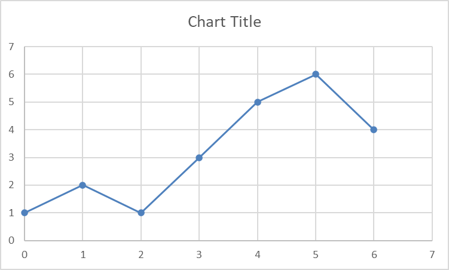
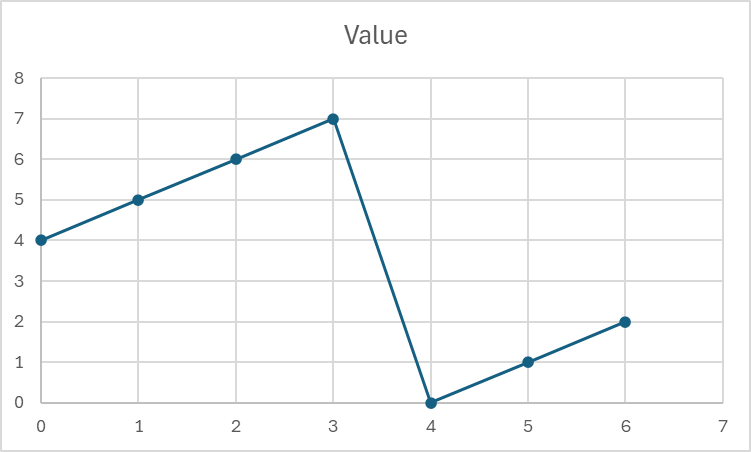
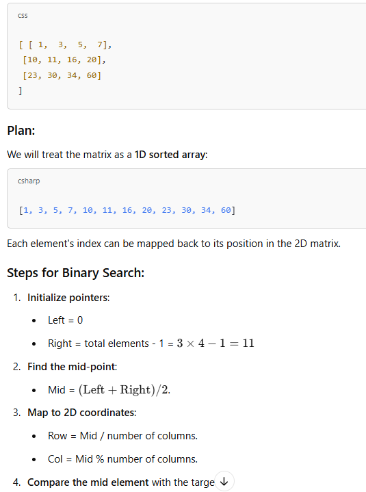
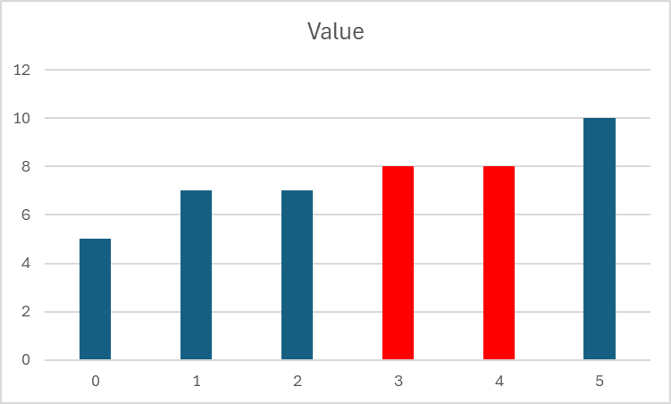
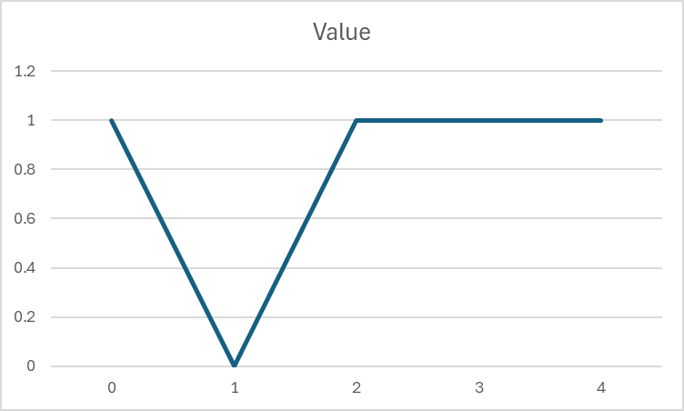
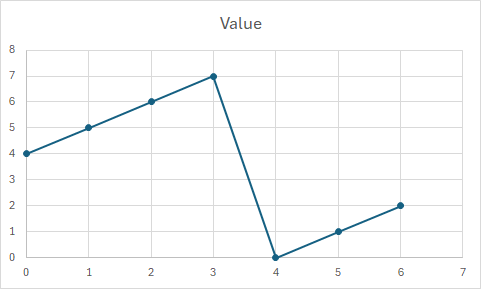

1. Find Peak Element: https://leetcode.com/problems/find-peak-element/description/  
Beats: 100%  

2. Search in Rotated Sorted Array: https://leetcode.com/problems/search-in-rotated-sorted-array/description/  
Beats: 100%  

3. Search 2D Matrix: https://leetcode.com/problems/search-a-2d-matrix/description/  
Beats: 100%  

4. Find First and Last Position of Element in Sorted Array: https://leetcode.com/problems/find-first-and-last-position-of-element-in-sorted-array/description/  
Beats: 100%  

5. Search in Rotated Sorted Array 2: https://leetcode.com/problems/search-in-rotated-sorted-array-ii/description/  
Beats: 100%  

6. Find Minimum in Rotated Sorted Array: https://leetcode.com/problems/find-minimum-in-rotated-sorted-array/description/  
Beats: 100%  

